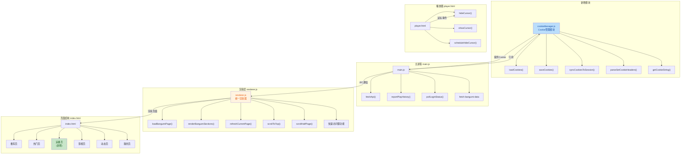

## 1. 高层摘要 (TL;DR)

* **影响范围**: 🟡 **中等** - 重大架构重构,新增功能模块
* **核心变更**:
  * ✨ 新增 **Cookie管理模块** (`cookieManager.js`),集中管理登录状态
  * 🔄 **架构重构**: 删除独立页面渲染器,统一整合到 `renderer.js`
  * 📺 新增 **追番页面** 功能,支持我的追番、番剧推荐、国创推荐、猜你喜欢
  * ⌨️ 新增 **快捷键系统**: 刷新(r)、回到顶部(gg)、上下翻页(d/e)、搜索(/)
  * 🖱️ 播放器新增 **鼠标自动隐藏** 功能

---

## 2. 可视化概览 (代码与逻辑图)



---

## 3. 详细变更分析

### 📦 3.1 新增 Cookie 管理模块

**模块**: `cookieManager.js` (新建)

**变更说明**:
将原本分散在 `main.js` 中的 Cookie 管理逻辑提取为独立模块,提供统一的 Cookie 操作接口。

**核心功能**:

| 函数名                                        | 功能描述                        |
| --------------------------------------------- | ------------------------------- |
| `loadCookies(filePath)`                     | 从文件加载 Cookie               |
| `saveCookies()`                             | 保存 Cookie 到文件              |
| `syncCookiesToSession(session)`             | 同步 Cookie 到 Electron Session |
| `clearCookies()`                            | 清除所有 Cookie                 |
| `parseSetCookieHeaders(headers)`            | 解析 Set-Cookie 响应头          |
| `getCookieString()`                         | 获取 Cookie 字符串格式          |
| `getSavedCookies()` / `setSavedCookies()` | 获取/设置 Cookie 对象           |

**代码示例**:

```javascript
// 从 session 获取所有 .bilibili.com 的 cookies
const sessionCookies = await session.cookies.get({ domain: '.bilibili.com' })
for (const cookie of sessionCookies) {
  savedCookies[cookie.name] = cookie.value
}
```

---

### 🏗️ 3.2 架构重构 - 统一渲染器

**删除文件**:

- ❌ `src/pages/dynamic.html`
- ❌ `src/pages/my.html`
- ❌ `src/pages/popular.html`
- ❌ `src/pages/up-profile.html`
- ❌ `src/renderer/dynamic-renderer.js`
- ❌ `src/renderer/media-renderer.js`
- ❌ `src/renderer/my-renderer.js`
- ❌ `src/renderer/popular-renderer.js`
- ❌ `src/renderer/up-renderer.js`

**修改文件**: `src/renderer/renderer.js`

**变更说明**:
将所有独立页面的渲染逻辑整合到统一的 `renderer.js` 中,采用单页应用(SPA)架构。所有页面内容现在都在 `index.html` 中,通过 JavaScript 控制显示/隐藏。

**新增追番页面功能**:

```javascript
async function loadBangumiPage() {
  const result = await ipcRenderer.invoke('fetch-bangumi-data', { is_refresh: 0 })
  renderBangumiSections(result.data)
}

function renderBangumiSections(data) {
  renderFollowingSection(data.sections[0])    // 我的追番
  renderAnimeRecommend(data.sections[1])      // 番剧推荐
  renderChineseRecommend(data.sections[2])    // 国创推荐
  renderGuessSection(data.sections[3])        // 猜你喜欢(瀑布流)
}
```

**页面状态管理**:

```javascript
let pageStates = {
  home: { pageNum: 1, loading: false, hasMore: true },
  popular: { pageNum: 1, loading: false, hasMore: true },
  bangumi: { cursor: '', loading: false, hasMore: true, data: null }, // 新增
  // ...
}
```

---

### 🎬 3.3 播放器鼠标自动隐藏

**文件**: `src/pages/player.html`

**变更说明**:
实现视频播放时鼠标自动隐藏功能,提升沉浸式观看体验。

**核心逻辑**:

| 函数                     | 功能                    |
| ------------------------ | ----------------------- |
| `showCursor()`         | 显示鼠标,清除隐藏计时器 |
| `hideCursor()`         | 隐藏鼠标(仅播放时)      |
| `scheduleHideCursor()` | 2秒后自动隐藏鼠标       |

**CSS 样式**:

```css
html.hide-cursor,
html.hide-cursor body {
  cursor: none;
}
```

**触发条件**:

- 视频播放中
- 鼠标移动到视频区域
- 鼠标静止 2 秒后自动隐藏
- 暂停或离开窗口时显示

---

### ⌨️ 3.4 快捷键系统增强

**文件**: `src/config/defaultShortcuts.conf`

**新增快捷键配置**:

| 快捷键                        | 功能       | 说明          |
| ----------------------------- | ---------- | ------------- |
| `Ctrl+F`, `Ctrl+L`, `/` | 聚焦搜索框 | 新增 `/` 键 |
| `Escape`, `u`             | 返回上一页 | 新增 `u` 键 |
| `r`                         | 刷新当前页 | 新增          |
| `g+g`                       | 回到顶部   | 双击 g        |
| `d`                         | 向下翻半页 | 新增          |
| `e`                         | 向上翻半页 | 新增          |

**实现代码** (`renderer.js`):

```javascript
// 刷新页面
function refreshCurrentPage() {
  const content = document.querySelector('.content')
  content.scrollTo({ top: 0, behavior: 'smooth' })
  
  if (currentPage === 'home') {
    pageStates.home.pageNum = 1
    fetchVideos(1, false)
  }
  // ... 其他页面逻辑
}

// 回到顶部 (双击 g)
if (e.key.toLowerCase() === 'g' && !pendingGoTop) {
  pendingGoTop = true
  setTimeout(() => { pendingGoTop = false }, 500)
} else if (e.key.toLowerCase() === 'g' && pendingGoTop) {
  scrollToTop()
}

// 半页滚动
function scrollHalfPage(direction) {
  const halfPage = Math.floor(viewHeight / 2)
  content.scrollTo({ 
    top: direction === 'up' ? currentTop - halfPage : currentTop + halfPage,
    behavior: 'smooth' 
  })
}
```

---

### 🔌 3.5 追番 API 集成

**文件**: `main.js`

**新增 IPC 处理器**:

```javascript
ipcMain.handle('fetch-bangumi-data', async (event, params) => {
  const { is_refresh = 0, cursor = '' } = params
  const url = `https://api.bilibili.com/pgc/page/pc/bangumi/tab?is_refresh=${is_refresh}`
  if (cursor) url += `&cursor=${cursor}`
  
  const bangumiHeaders = {
    'user-agent': 'Mozilla/5.0 ... bilibili_pc/1.17.5 ...',
    'x-app-version': '1.17.6',
    // ... 其他请求头
  }
  
  const result = await fetchApiWithHeaders(url, bangumiHeaders)
  return { success: true, data: result }
})
```

**新增请求函数**:

```javascript
function fetchApiWithHeaders(url, customHeaders = {}) {
  // 支持自定义请求头
  // 自动解析 Set-Cookie 响应头
  // 支持 gzip/br 解压缩
  // 15秒超时
}
```

---

### 🎨 3.6 UI 细节优化

**文件**: `index.html`

| 变更项     | 旧值       | 新值                                     |
| ---------- | ---------- | ---------------------------------------- |
| 导航栏     | 无追番入口 | 新增 `<a data-page="bangumi">追番</a>` |
| UP主获赞数 | 注释隐藏   | 显示 `<span id="viewCount">0</span>`   |
| 设置标题   | 无         | 新增 `<h3>常规设置</h3>`               |

---

### 📝 3.7 任务状态更新

**文件**: `TODO.md`

**已完成任务** (标记为 `[X]`):

- ✅ 每个页面右下角显示刷新按钮
- ✅ 每个页面下滑后显示回到顶部按钮
- ✅ 实现点击打开 mpv 播放器播放视频
- ✅ 实现播放器弹幕支持
- ✅ 弹幕开关记忆
- ✅ 点击播放默认按视频比例显示窗口
- ✅ gg 回到顶部
- ✅ u 返回
- ✅ r 刷新页面
- ✅ d 往下滚半页
- ✅ e 往上滚半页
- ✅ / 搜索

**新增待办**:

- 📋 播放视频自动隐藏鼠标
- 📋 鼠标滚轮功能,调整音量
- 📋 按住 ctrl 可以调整进度
- 📋 右键菜单(先解决右键无法显示的bug)
- 📋 刷新按钮功能bug

---

## 4. 影响与风险评估

### ⚠️ 4.1 破坏性变更

| 变更类型            | 影响范围          | 风险等级 |
| ------------------- | ----------------- | -------- |
| 删除独立页面HTML/JS | 所有页面渲染逻辑  | 🔴 高    |
| Cookie管理重构      | 登录/认证相关功能 | 🟡 中    |
| 快捷键配置变更      | 用户自定义快捷键  | 🟡 低    |

### 🧪 4.2 测试建议

**功能测试**:

1. ✅ **登录流程**: 验证 Cookie 正确保存和加载
2. ✅ **追番页面**: 测试我的追番、番剧推荐、国创推荐、猜你喜欢加载
3. ✅ **快捷键**: 测试所有新增快捷键 (r, gg, d, e, /, u)
4. ✅ **播放器**: 验证鼠标自动隐藏功能(播放/暂停/移动)
5. ✅ **页面切换**: 确认所有页面能正常切换和加载

**兼容性测试**:

- 验证旧版 Cookie 文件能否正确迁移
- 测试用户自定义快捷键配置是否生效

**边界情况**:

- 追番页面无数据时的显示
- 网络请求失败时的错误处理
- 快捷键冲突检测

---

## 5. 总结

本次提交是一次**重大架构重构**,主要完成了以下目标:

1. **模块化**: 提取 Cookie 管理为独立模块,提高代码复用性
2. **统一化**: 整合所有页面渲染逻辑,简化维护成本
3. **功能增强**: 新增追番页面、快捷键系统、鼠标自动隐藏等实用功能
4. **用户体验**: 优化交互细节,提升沉浸式体验

建议在合并前进行**全面回归测试**,特别是登录和页面切换相关功能。
