## 1. 高层摘要 (TL;DR)

* **影响范围:** 🟡 **中等** - 新增影视页面完整功能，优化用户体验，修复多个UI交互问题
* **核心变更:**
  * ✨ 新增完整的影视页面（电影、电视剧、纪录片、综艺等分类）
  * 🔧 实现影视数据获取和筛选功能
  * 👤 优化"我的"页面，新增用户等级、动态数、关注数、粉丝数显示
  * 🗑️ 新增历史记录删除功能
  * 🎨 修复"回到顶部"按钮显示逻辑
  * 🎬 优化播放器窗口拖拽体验

---

## 2. 可视化概览 (代码与逻辑映射)

```mermaid
graph TD
    subgraph "主进程 main.js"
        A["fetch-media-data<br/>影视页面数据"]
        B["fetch-media-condition<br/>影视筛选条件"]
        C["fetch-media-result<br/>影视搜索结果"]
        D["get-user-info<br/>用户信息+统计数据"]
        E["delete-history<br/>删除历史记录"]
    end
  
    subgraph "渲染进程 renderer.js"
        F["loadMediaPage<br/>加载影视页面"]
        G["loadMediaAllFilters<br/>加载筛选条件"]
        H["loadMediaAllData<br/>加载影视全部页"]
        I["loadDrama<br/>加载追剧内容"]
        J["updateMyPageUI<br/>更新用户界面"]
        K["handleScroll<br/>滚动处理+回到顶部"]
    end
  
    subgraph "页面结构 index.html"
        L["page-media<br/>影视主页"]
        M["page-media-all<br/>影视全部页"]
        N["drama-content<br/>追剧标签页"]
        O["my-right-content<br/>用户统计数据"]
    end
  
    A --> F
    B --> G
    C --> H
    D --> J
    E --> K
    F --> L
    G --> M
    I --> N
    J --> O
  
    style A fill:#bbdefb,color:#0d47a1
    style B fill:#bbdefb,color:#0d47a1
    style C fill:#bbdefb,color:#0d47a1
    style D fill:#c8e6c9,color:#1a5e20
    style E fill:#ffcdd2,color:#b71c1c
    style F fill:#fff3e0,color:#e65100
    style G fill:#fff3e0,color:#e65100
    style H fill:#fff3e0,color:#e65100
```



---

## 3. 详细变更分析

### 🎬 3.1 影视页面功能模块

#### **新增影视页面结构 (index.html)**

| 区域       | ID                    | 功能说明                     |
| ---------- | --------------------- | ---------------------------- |
| 我的追剧   | `media-following`   | 横向滚动列表展示用户追剧内容 |
| 正在热播   | `media-hot`         | 网格展示热门影视内容         |
| 电影热播   | `media-movie`       | 电影分类热播内容             |
| 电视剧热播 | `media-tv`          | 电视剧分类热播内容           |
| 纪录片热播 | `media-documentary` | 纪录片分类热播内容           |
| 综艺热播   | `media-variety`     | 综艺分类热播内容             |
| 猜你喜欢   | `media-guess`       | 瀑布流推荐内容，支持无限滚动 |

#### **新增影视全部页 (index.html)**

新增 `page-media-all` 页面，包含以下筛选条件：

| 筛选项   | 参数ID                    | 说明         |
| -------- | ------------------------- | ------------ |
| 综合排序 | `media-sort-options`    | 排序方式选择 |
| 全部地区 | `media-area-options`    | 地区筛选     |
| 全部风格 | `media-style-options`   | 风格筛选     |
| 上映时间 | `media-release-options` | 上映时间筛选 |
| 付费状态 | `media-status-options`  | 付费类型筛选 |

#### **影视数据接口 (main.js)**

**新增 IPC 处理器:**

1. **`fetch-media-data`** (行 1001-1105)

   * 接口: `https://api.bilibili.com/pgc/page/pc/cinema/tab`
   * 参数: `is_refresh`, `cursor`
   * 特性:
     * 自动获取 `sec_ck` cookie
     * 使用官方客户端请求头模拟
     * 支持分页加载
2. **`fetch-media-condition`** (行 1185-1207)

   * 接口: `https://api.bilibili.com/pgc/page/index/condition`
   * 参数: `index_type=2`, `type=2`
   * 返回影视页面的筛选条件选项
3. **`fetch-media-result`** (行 1209-1246)

   * 接口: `https://api.bilibili.com/pgc/page/index/result`
   * 参数: `area`, `style_id`, `release_date`, `season_status`, `type`, `order`, `index_type`, `page`
   * 支持多条件组合筛选

#### **修复追番筛选参数 (main.js)**

**问题:** `fetch-bangumi-result` 中参数类型不一致导致筛选失效

**修复内容 (行 1155-1166):**

```javascript
// 修复前: if (area !== -1) url += `&area=${area}`
// 修复后:
if (String(area) !== '-1') url += `&area=${area}`
if (String(year) !== '-1') url += `&year=${encodeURIComponent(year)}`
```

**改进点:**

* 使用 `String(value) !== '-1'` 统一处理字符串和数字类型
* 对年份参数进行 URL 编码（处理 `[2025,2026)` 等特殊字符）

---

### 👤 3.2 用户信息增强

#### **新增用户统计数据 (main.js)**

**扩展 `get-user-info` 接口 (行 2604-2641):**

| 数据项 | 接口                              | 说明             |
| ------ | --------------------------------- | ---------------- |
| 获赞数 | `/x/web-interface/card`         | 用户获得的点赞数 |
| 关注数 | `/x/relation/stat`              | 用户关注的人数   |
| 粉丝数 | `/x/relation/stat`              | 用户的粉丝数     |
| 动态数 | `/x/dynamic/feed/space/dyn_num` | 用户发布的动态数 |

**返回数据结构:**

```javascript
{
  following: following,    // 关注数
  follower: follower,      // 粉丝数
  viewCount: viewCount,    // 获赞数
  dynCount: dynCount       // 动态数
}
```

#### **用户界面更新 (index.html + renderer.js + style.css)**

**新增UI元素:**

* 用户等级徽章 (`myUserLevel`) - 显示 `LvX` 渐变色标签
* 统计数据区域 (`my-right-content`) - 显示动态、关注、粉丝数量
* 追剧标签页 (`drama-content`) - 独立的追剧内容展示

**样式优化 (style.css):**

```css
.my-user-level {
  background: linear-gradient(135deg, #fb7299 0%, #ff85ad 100%);
  color: #fff;
  padding: 2px 8px;
  border-radius: 4px;
}

.my-stats {
  display: flex;
  gap: 30px;
}
```

---

### 🗑️ 3.3 历史记录删除功能

#### **新增删除接口 (main.js)**

**`delete-history` IPC 处理器 (行 2770-2842):**

| 配置项       | 值                                               |
| ------------ | ------------------------------------------------ |
| 接口         | `https://api.bilibili.com/x/v2/history/delete` |
| 方法         | POST                                             |
| 参数         | `bvid`, `csrf`, `csrf_token`               |
| Content-Type | `application/x-www-form-urlencoded`            |

**实现细节:**

* 使用 `https` 模块直接发送请求
* 从 cookie 中获取 `bili_jct` 作为 CSRF token
* 返回 `{ success: true/false, error: string }`

#### **前端交互 (renderer.js)**

**历史记录卡片增强 (行 1541-1609):**

```javascript
// 添加更多操作按钮
<div class="history-more-wrapper">
  <button class="history-more-btn">...</button>
  <div class="history-dropdown">
    <div class="dropdown-item delete-history-btn">删除记录</div>
  </div>
</div>

// 删除逻辑
deleteBtn.addEventListener('click', async e => {
  const result = await ipcRenderer.invoke('delete-history', video.bvid)
  if (result.success) {
    card.remove()
    // 检查是否为空，显示空状态提示
  }
})
```

**样式支持 (style.css 行 4951-5058):**

* 更多按钮悬停效果
* 下拉菜单定位和动画
* 暗色主题适配
* 删除按钮红色警告样式

---

### 🔄 3.4 滚动与回到顶部优化

#### **回到顶部按钮修复 (index.html + renderer.js)**

**问题:** 按钮在页面顶部时仍然显示

**修复方案:**

1. **HTML (index.html 行 764):**

   ```html
   <!-- 默认添加 hidden 类 -->
   <button class="bottom-action-btn backtop-btn hidden" id="backTopBtn">
   ```
2. **CSS (style.css 行 3098-3102):**

   ```css
   .backtop-btn.hidden {
     opacity: 0;
     visibility: hidden;
     transform: translateY(20px);
   }
   ```
3. **JS (renderer.js 行 1990-1997):**

   ```javascript
   const backTopBtn = document.getElementById('backTopBtn')
   if (backTopBtn) {
     if (scrollTop > 300) {
       backTopBtn.classList.remove('hidden')
     } else {
       backTopBtn.classList.add('hidden')
     }
   }
   ```

#### **无限滚动扩展 (renderer.js)**

**新增影视页面滚动加载 (行 2070-2091):**

```javascript
} else if (currentPage === 'media') {
  if (scrollTop + clientHeight >= scrollHeight - 300) {
    const state = pageStates.media
    if (!state.loading && state.hasMore && state.cursor) {
      loadMoreMediaGuessItems()
    }
  }
} else if (currentPage === 'media-all') {
  if (scrollTop + clientHeight >= scrollHeight - 300) {
    if (!mediaAllState.loading && mediaAllState.hasMore) {
      loadMediaAllData(true)
    }
  }
}
```

---

### 🎮 3.5 播放器窗口拖拽优化

#### **拖拽区域重构 (src/pages/player.html)**

**问题:** 原有的 `.drag-region` 区域过大，影响视频播放控制

**解决方案 (行 58-229):**

1. **禁用默认拖拽:**

   ```css
   .player-header {
     pointer-events: none;  /* 隐藏时禁用交互 */
   }
   .player-header.visible {
     pointer-events: auto;  /* 显示时启用交互 */
   }
   .video-area, .video-area * {
     -webkit-app-region: no-drag;  /* 视频区域不拖拽 */
   }
   ```
2. **自定义拖拽逻辑 (行 1081-1135):**

   ```javascript
   // 在视频区域实现自定义拖拽
   videoArea.addEventListener('mousedown', async (e) => {
     // 排除控制按钮区域
     const ignoreControl = e.target.closest('.player-controls, .video-info-panel, ...')
     if (ignoreControl) return

     // 获取窗口位置
     const pos = await ipcRenderer.invoke('get-window-position')
     isWindowDragging = true
     dragStart = { screenX: e.screenX, screenY: e.screenY }
     windowStart = { x: pos.x, y: pos.y }

     // 监听移动和释放
     document.addEventListener('mousemove', handleWindowDrag)
     document.addEventListener('mouseup', stopWindowDrag)
   })
   ```
3. **防止视频拖拽 (行 1123-1135):**

   ```javascript
   videoArea.addEventListener('dragstart', (e) => e.preventDefault())
   videoPlayer.addEventListener('dragstart', (e) => e.preventDefault())
   document.addEventListener('dragstart', (e) => {
     if (isWindowDragging) e.preventDefault()
   })
   ```

#### **IPC 方法修改 (main.js)**

**行 1904:** 将 `set-window-position-direct` 从 `ipcMain.on` 改为 `ipcMain.handle`，支持异步调用

---

### 🎨 3.6 UI/UX 细节优化

#### **追番筛选器改进 (index.html)**

**新增"更多筛选"按钮 (行 283-288):**

```html
<button class="more-filter-btn" id="moreFilterBtn">
  <span class="more-filter-text">更多筛选</span>
  <svg class="more-filter-icon">...</svg>
</button>
```

**可收缩筛选区域 (行 306-328):**

```html
<div class="filter-expandable" id="filterExpandable" style="display: none;">
  <div class="filter-row" id="filter-audio">配音类型</div>
  <div class="filter-row" id="filter-copyright">版权类型</div>
  <div class="filter-row" id="filter-status">完结状态</div>
  <div class="filter-row" id="filter-year">全部年份</div>
  <div class="filter-row" id="filter-quarter">全部季度</div>
</div>
```

**样式支持 (style.css 行 3286-3317):**

```css
.more-filter-btn {
  border: 2px solid #fb7299;
  color: #fb7299;
  border-radius: 20px;
}
.more-filter-btn.expanded .more-filter-icon {
  transform: rotate(180deg);  /* 展开时旋转图标 */
}
```

#### **徽章样式优化 (style.css)**

**新增徽章容器 (行 3406-3413):**

```css
.badges-container {
  position: absolute;
  top: 8px;
  right: 8px;  /* 改为右侧显示 */
  display: flex;
  gap: 4px;
}
```

**徽章颜色调整 (行 3424-3434):**

```css
.bangumi-all-badge.red { background: #FB7299; }
.bangumi-all-badge.blue { background: #00C0FF; }
.bangumi-all-badge.green { background: #5CB85C; }  /* 从 #56C425 调整 */
```

#### **追剧标签页实现 (renderer.js)**

**新增 `loadDrama` 函数 (行 1763-1821):**

```javascript
async function loadDrama() {
  const result = await ipcRenderer.invoke('get-bangumi-follow', 2, 1)
  // 渲染追剧卡片
  result.data.forEach(item => {
    card.innerHTML = `
      <div class="my-anime-cover">
        
        ${item.badge ? `<span>${item.badge}</span>` : ''}
        ${item.new_ep?.index ? `<span>第${item.new_ep.index}集</span>` : ''}
      </div>
      <div class="my-anime-info">
        <h3>${item.title}</h3>
        <div class="my-anime-history">
          <span>${item.is_finish ? '已完结' : '连载中'}</span>
          <span>${item.stat?.follow}人追剧</span>
        </div>
      </div>
    `
  })
}
```

---

### 📝 3.7 其他改进

#### **TODO 更新 (TODO.md)**

| 任务             | 状态      | 说明             |
| ---------------- | --------- | ---------------- |
| 回到顶部按钮隐藏 | ✅ 已完成 | 在顶部时正确隐藏 |
| 追番配音类型展示 | ⏳ 待处理 | 新增到TODO列表   |
| 视频预览功能     | ⏳ 待处理 | 雪碧图预览       |
| 动态数显示       | ✅ 已实现 | 使用新接口       |

#### **关于页面更新 (index.html 行 748)**

```html
<p>基于 Electron 构建的哔哩哔哩客户端， <br>
  仅供学习使用，不涉及任何商业用途。</p>
<!-- 移除了 "MPV" 描述 -->
```

#### **UP主信息调整 (index.html 行 566-569)**

```html
<!-- 注释掉获赞数显示 -->
<!-- <div class="stat-item">
  <span class="stat-value" id="viewCount">0</span>
  <span class="stat-label">获赞数</span>
</div> -->
```

---

## 4. 影响与风险评估

### ⚠️ 4.1 破坏性变更

| 变更项                                    | 影响               | 建议                         |
| ----------------------------------------- | ------------------ | ---------------------------- |
| `set-window-position-direct` 改为 async | 播放器窗口拖拽逻辑 | 确保所有调用处使用 `await` |
| 追番筛选参数类型处理                      | 筛选功能           | 测试所有筛选条件组合         |
| 影视页面新增                              | 新功能入口         | 测试页面切换和数据加载       |

### 🧪 4.2 测试建议

#### **功能测试:**

1. **影视页面:**

   * [ ] 测试各分类（电影、电视剧、纪录片、综艺）数据加载
   * [ ] 测试"猜你喜欢"无限滚动
   * [ ] 测试"查看全部"跳转到筛选页
   * [ ] 测试筛选条件组合（地区+风格+时间+付费状态）
2. **用户信息:**

   * [ ] 测试登录后用户等级显示
   * [ ] 测试统计数据（动态、关注、粉丝）准确性
   * [ ] 测试未登录状态下的UI显示
3. **历史记录:**

   * [ ] 测试删除单条历史记录
   * [ ] 测试删除后空状态提示
   * [ ] 测试删除失败的错误处理
4. **回到顶部:**

   * [ ] 测试滚动超过300px时按钮显示
   * [ ] 测试回到顶部后按钮隐藏
   * [ ] 测试点击按钮滚动到顶部
5. **播放器拖拽:**

   * [ ] 测试视频区域拖拽窗口
   * [ ] 测试控制按钮区域不触发拖拽
   * [ ] 测试视频元素不被拖拽

#### **边界测试:**

* [ ] 影视数据为空时的显示
* [ ] 网络错误时的重试机制
* [ ] Cookie 过期时的处理
* [ ] 大量历史记录时的性能

#### **兼容性测试:**

* [ ] 暗色主题下的样式显示
* [ ] 不同分辨率下的布局适配
* [ ] 触摸设备上的交互

---

## 5. 总结

本次更新主要完成了 **影视页面的完整实现**，包括数据获取、筛选、展示和交互功能，同时优化了用户体验（回到顶部、窗口拖拽）和增强了用户信息展示（统计数据、等级）。代码质量良好，新增功能模块化清晰，建议重点测试影视页面的数据加载和筛选功能，以及历史记录删除的边界情况。
