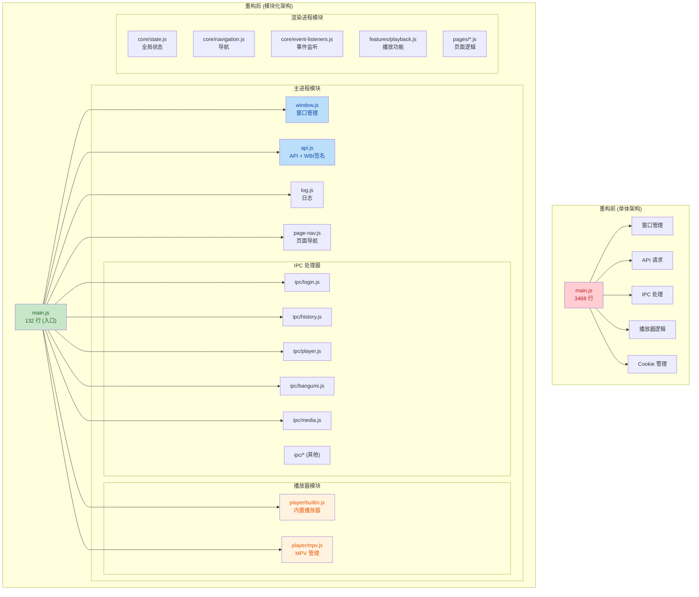
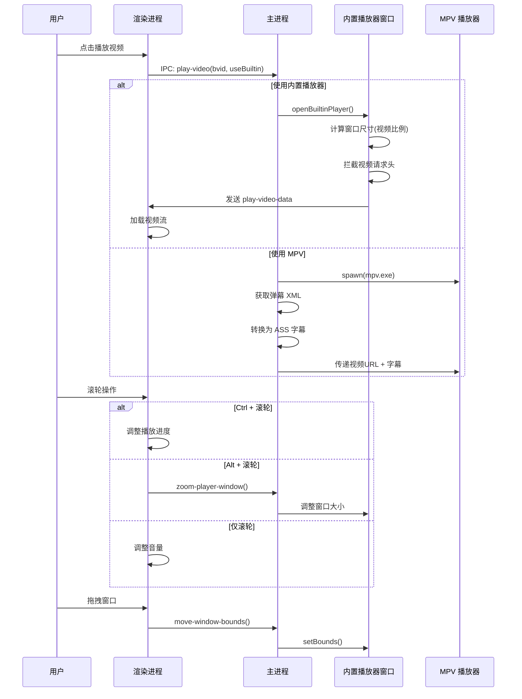

## 1. 高层摘要 (TL;DR)

**影响范围**: 🔴 **高** - 大规模代码重构，涉及架构重组、模块拆分和功能增强

**核心变更**:

- 🏗️ **架构重构**: 将 3400+ 行的单体 `main.js` 拆分为 20+ 个模块化文件
- 🎬 **播放器增强**: 新增内置播放器窗口管理，优化 MPV 集成，新增滚轮控制
- 📦 **模块化设计**: 主进程和渲染进程均采用模块化架构，职责清晰
- 🍪 **Cookie 管理**: 新增启动时 Cookie 导入、sec_ck 获取等增强功能
- 🎨 **样式重组**: CSS 文件按组件和页面拆分，提升可维护性

---

## 2. 可视化架构图

### 代码架构重构前后对比



### 播放器交互增强流程



---

## 3. 详细变更分析

### 3.1 核心架构重构

#### 主进程模块化

| 原位置      | 新模块                         | 职责                            | 代码行数 |
| ----------- | ------------------------------ | ------------------------------- | -------- |
| `main.js` | `src/main/window.js`         | 窗口创建、最小化/最大化/关闭    | 109 行   |
| `main.js` | `src/main/api.js`            | API 请求、WBI 签名、Cookie 处理 | 363 行   |
| `main.js` | `src/main/log.js`            | 彩色日志输出、文件日志          | 48 行    |
| `main.js` | `src/main/page-nav.js`       | 页面导航 IPC 处理               | 57 行    |
| `main.js` | `src/main/player/builtin.js` | 内置播放器窗口管理              | 448 行   |
| `main.js` | `src/main/player/mpv.js`     | MPV 进程和 Socket 管理          | 229 行   |
| `main.js` | `src/main/ipc/login.js`      | 登录、Cookie 导入/导出          | 445 行   |
| `main.js` | `src/main/ipc/history.js`    | 历史记录获取/删除/搜索          | 292 行   |
| `main.js` | `src/main/ipc/player.js`     | 视频播放、弹幕、清晰度          | 487 行   |
| `main.js` | `src/main/ipc/bangumi.js`    | 追番数据获取                    | 206 行   |
| `main.js` | `src/main/ipc/media.js`      | 影视数据获取                    | 173 行   |

**关键改进**:

- ✅ **依赖注入**: 所有模块通过 `deps` 对象接收依赖，便于测试和维护
- ✅ **职责分离**: 每个模块只负责单一功能
- ✅ **可复用性**: 工具函数如 `fetchApi`、`log` 被多个模块共享

#### 渲染进程模块化

| 新模块                                      | 职责                                         |
| ------------------------------------------- | -------------------------------------------- |
| `src/renderer/core/state.js`              | 全局状态管理（用户、页面、快捷键、页面状态） |
| `src/renderer/core/navigation.js`         | 页面导航、滚动控制、返回功能                 |
| `src/renderer/core/event-listeners.js`    | 所有 DOM 事件监听器集中初始化                |
| `src/renderer/features/playback.js`       | 播放功能封装                                 |
| `src/renderer/features/scroll-handler.js` | 滚动处理                                     |
| `src/renderer/features/shortcuts.js`      | 快捷键处理                                   |
| `src/renderer/features/page-loader.js`    | 页面加载器                                   |
| `src/renderer/components/*.js`            | 组件逻辑（登录、视频卡片等）                 |
| `src/renderer/pages/*.js`                 | 各页面业务逻辑                               |

**脚本加载顺序** (Source: `index.html`):

```html
<!-- 1. 核心模块 (必须最先加载) -->
<script src="src/renderer/core/state.js"></script>
<script src="src/renderer/core/utils.js"></script>
<script src="src/renderer/core/navigation.js"></script>

<!-- 2. 组件模块 -->
<script src="src/renderer/components/video-card.js"></script>
<script src="src/renderer/components/login.js"></script>
...

<!-- 3. 功能模块 -->
<script src="src/renderer/features/playback.js"></script>
...

<!-- 4. 页面模块 -->
<script src="src/renderer/pages/home.js"></script>
...

<!-- 5. 事件监听器 (最后加载，包含 DOMContentLoaded 入口) -->
<script src="src/renderer/core/event-listeners.js"></script>
```

---

### 3.2 API 和 Cookie 管理增强

#### WBI 签名实现 (Source: `src/main/api.js`)

```javascript
// WBI 签名流程
async function fetchWbiKeys() {
  // 从 nav 接口获取 img_key 和 sub_key
  // 缓存 1 小时
}

function getMixKey(imgKey, subKey) {
  // 按固定表位混合两个 key
  const MIXIN_KEY_ENC_TAB = [46, 47, 18, ...]
  // 返回 32 位 mixKey
}

function signParams(params, mixKey) {
  const wts = Math.floor(Date.now() / 1000)
  // 参数排序 + 拼接 + MD5
  return { w_rid, wts }
}
```

#### Cookie 导入增强 (Source: `src/main/ipc/login.js`)

| 功能                  | 说明                                                      |
| --------------------- | --------------------------------------------------------- |
| **启动时导入**  | 从 `userData/import_cookie_string.txt` 或剪贴板自动导入 |
| **sec_ck 获取** | 请求推荐接口触发下发，从 session 读取                     |
| **Cookie 同步** | 登录后从 session 导出并合并到 savedCookies                |
| **调试工具**    | `dump-session-cookies`、`replay-bangumi-with-cookies` |

**关键代码**:

```javascript
// 启动时尝试导入 Cookie
async function tryImportCookiesOnStartup() {
  // 1. 尝试从文件读取
  const importFile = path.join(userDataPath, 'import_cookie_string.txt')
  // 2. 尝试从剪贴板读取
  const clip = clipboard.readText().trim()
  // 3. 解析并写入 session
  await importCookieStringFromText(cookieString)
}
```

---

### 3.3 播放器功能增强

#### 内置播放器窗口管理 (Source: `src/main/player/builtin.js`)

| 功能                   | 实现方式                                  |
| ---------------------- | ----------------------------------------- |
| **窗口尺寸计算** | 根据视频比例自动计算，默认工作区 70% 高度 |
| **窗口拖拽**     | 鼠标左键拖拽视频区域移动窗口              |
| **窗口缩放**     | 滚轮 Alt+滚动调整大小，接近最大时进入全屏 |
| **多显示器支持** | `move-to-next-display` 切换显示器       |
| **Cookie 复制**  | 从主窗口复制所有 Cookie 到播放器窗口      |
| **请求拦截**     | 拦截视频请求，添加 Referer 和 User-Agent  |

**窗口尺寸计算逻辑**:

```javascript
const videoAspect = videoW / videoH
const defaultHeight = Math.floor(workArea.height * 0.7)
const defaultWidth = Math.floor(defaultHeight * videoAspect)

// 限制最大宽度为工作区 85%
if (defaultWidth > workArea.width * 0.85) {
  windowWidth = Math.floor(workArea.width * 0.85)
  windowHeight = Math.floor(windowWidth / videoAspect)
}
```

#### 播放器交互增强 (Source: `src/pages/player.html`)

| 交互类型           | 触发方式             | 功能               |
| ------------------ | -------------------- | ------------------ |
| **音量调节** | 滚轮                 | 直接调整音量       |
| **进度调整** | Ctrl + 滚轮          | 前进/后退 5 秒     |
| **窗口缩放** | Alt + 滚轮           | 放大/缩小窗口      |
| **窗口拖拽** | 鼠标左键拖拽视频区域 | 移动窗口位置       |
| **鼠标隐藏** | 播放时静止 2 秒      | 自动隐藏鼠标和控件 |

**滚轮控制代码**:

```javascript
document.addEventListener('wheel', (e) => {
  if (e.ctrlKey) {
    // 调整进度
    videoPlayer.currentTime += e.deltaY > 0 ? 5 : -5
  } else if (e.altKey) {
    // 调整窗口大小
    ipcRenderer.invoke('zoom-player-window', e.deltaY > 0 ? -1 : 1)
  } else {
    // 调整音量
    videoPlayer.volume = Math.max(0, Math.min(1, videoPlayer.volume + delta))
  }
}, { passive: false })
```

---

### 3.4 样式文件重组

#### CSS 模块化结构

| 类型               | 文件                           | 说明                       |
| ------------------ | ------------------------------ | -------------------------- |
| **基础样式** | `src/style/base.css`         | 重置、基础类               |
| **布局样式** | `src/style/layout.css`       | 侧边栏、内容区布局         |
| **组件样式** | `src/style/components/*.css` | 登录框、视频卡片、搜索框等 |
| **页面样式** | `src/style/pages/*.css`      | 各页面特定样式             |
| **主题样式** | `src/style/dark-theme.css`   | 暗色主题（最后加载）       |

**优势**:

- ✅ 按需加载（未来可优化）
- ✅ 职责清晰，易于维护
- ✅ 避免样式冲突

---

### 3.5 历史记录功能增强 (Source: `src/main/ipc/history.js`)

| IPC Handler               | 功能                            |
| ------------------------- | ------------------------------- |
| `get-history`           | 获取历史记录（支持分页 cursor） |
| `delete-history`        | 删除单条历史记录                |
| `search-history`        | 搜索历史记录                    |
| `report-play-progress`  | 上报播放进度（实时）            |
| `report-final-progress` | 上报最终播放进度（关闭时）      |

**时间格式化**:

```javascript
function formatHistoryTime(timestamp) {
  const diff = now - timestamp
  if (diff < 60) return '刚刚'
  if (diff < 3600) return `${Math.floor(diff / 60)}分钟前`
  if (diff < 86400) return `${Math.floor(diff / 3600)}小时前`
  if (diff < 604800) return `${Math.floor(diff / 86400)}天前`
  return `${date.getMonth() + 1}月${date.getDate()}日`
}
```

---

## 4. 影响与风险评估

### ⚠️ 破坏性变更

| 变更类型               | 影响                                      | 缓解措施                     |
| ---------------------- | ----------------------------------------- | ---------------------------- |
| **文件结构重组** | 旧版插件/脚本可能失效                     | 无（这是内部重构）           |
| **全局变量位置** | `main.js` 中的全局变量移至 `state.js` | 渲染进程脚本需按新顺序加载   |
| **Cookie 管理**  | Cookie 导入逻辑变更                       | 新增启动时自动导入，向后兼容 |

### ✅ 测试建议

| 测试场景            | 验证点                                   |
| ------------------- | ---------------------------------------- |
| **启动流程**  | Cookie 自动导入、登录状态保持            |
| **播放器**    | 内置播放器窗口尺寸、拖拽、缩放、滚轮控制 |
| **历史记录**  | 分页加载、删除、搜索、进度上报           |
| **追番/影视** | sec_ck 获取、数据加载、筛选功能          |
| **页面导航**  | 页面切换、返回按钮、滚动控制             |
| **快捷键**    | 所有快捷键正常工作、无冲突               |

### 🐛 已知问题 (TODO.md)

- [ ] 历史记录删除接口 400 错误（Cookie 问题）
- [ ] q 退出键和标签键冲突
- [ ] 追番全部页面配音类型选项未展示
- [ ] UP 主页面跳转关注页面数据错误

---

## 5. 总结

这是一次**大规模的代码重构**，主要目标是将单体应用拆分为模块化架构，提升代码可维护性和可扩展性。同时，播放器功能得到显著增强，新增了内置播放器窗口、滚轮控制、窗口拖拽等交互功能。

**重构亮点**:

1. 🏗️ **清晰的模块边界**: 主进程和渲染进程均按功能拆分
2. 🔧 **依赖注入模式**: 便于单元测试和模块替换
3. 🎬 **播放器体验提升**: 接近 MPV 的交互体验
4. 🍪 **Cookie 管理增强**: 支持多种导入方式，自动同步
5. 📦 **样式模块化**: CSS 按组件和页面拆分

**建议后续工作**:

- 完成单元测试覆盖
- 优化样式加载（按需加载）
- 修复 TODO 中的已知问题
- 考虑使用 TypeScript 提升类型安全
