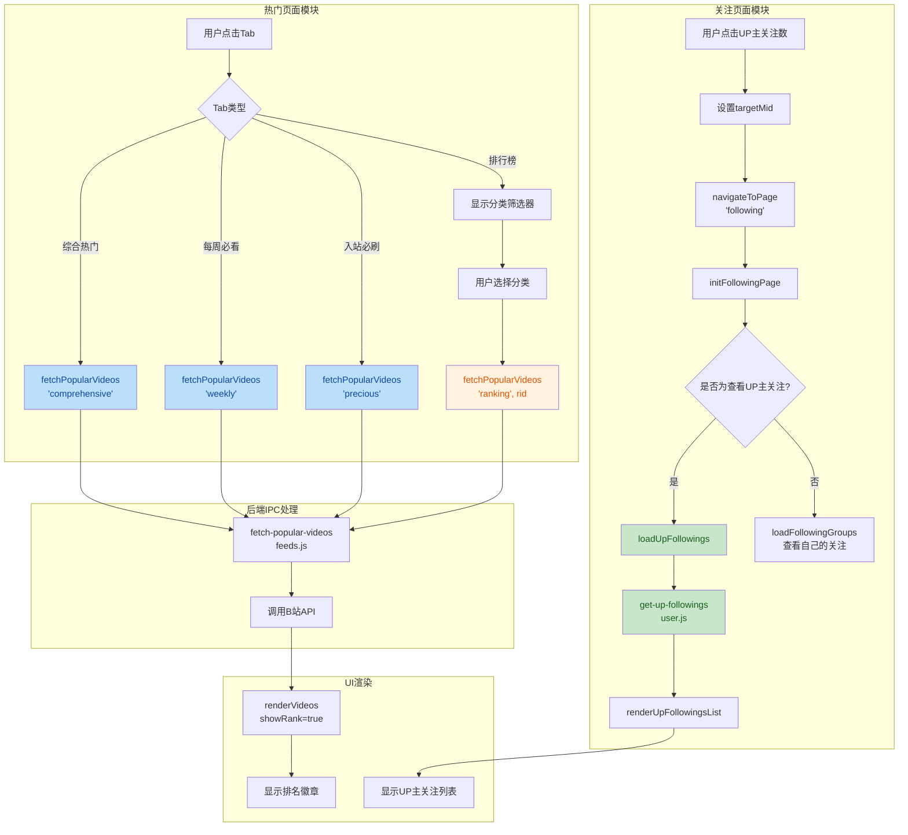

## 1. 高层摘要 (TL;DR)

* **影响范围：** 🟡 **中等** - 新增热门页面多Tab切换功能、UP主关注列表查看能力，以及多项UI/UX优化
* **核心变更：**
  * ✨ 热门页面新增4个Tab（综合热门、每周必看、入站必刷、排行榜）及排行榜分类筛选
  * ✨ 支持从UP主页面跳转查看该UP主的关注列表
  * 🎨 视频卡片添加排名徽章（排行榜模式）
  * 🎨 动态页面滚动条优化（鼠标移入显示，移出隐藏）
  * 🐛 修复从UP主页面跳转到关注页面的数据错误

---

## 2. 可视化概览 (代码与逻辑映射)



---

## 3. 详细变更分析

### 📊 模块一：热门页面功能增强

#### 🎯 变更说明

实现了热门页面的多Tab切换功能，支持综合热门、每周必看、入站必刷、排行榜四个维度，排行榜支持按分区筛选。

#### 📋 API接口变更

| Tab类型  | 接口地址                                | 参数                                                                      | 说明             |
| -------- | --------------------------------------- | ------------------------------------------------------------------------- | ---------------- |
| 综合热门 | `/x/web-interface/popular`            | `ps=40, pn={page}, web_location=bilibili-electron`                      | 综合热门视频列表 |
| 每周必看 | `/x/web-interface/popular/series/one` | `number=373, web_location=bilibili-electron`                            | 每周必看系列     |
| 入站必刷 | `/x/web-interface/popular/precious`   | `ps=30, pn={page}, web_location=bilibili-electron`                      | 入站必刷视频     |
| 排行榜   | `/x/web-interface/ranking/v2`         | `rid={rid}, type=all, ps=30, pn={page}, web_location=bilibili-electron` | 分区排行榜       |

#### 📂 核心文件变更

**`src/renderer/pages/popular.js`**

- 新增 `initPopularTabs()` 函数：初始化Tab切换逻辑
- 新增 `initRankingFilters()` 函数：初始化排行榜分类筛选
- 重构 `fetchPopularVideos()` 函数：支持 `tab` 和 `rid` 参数
- 添加排名徽章显示逻辑：`showRank` 选项控制

**`src/main/ipc/feeds.js`**

- 重构接口路由逻辑，分离不同Tab的API调用
- 综合热门和排行榜使用不同的接口端点

**`index.html`**

- 添加热门页面Tab UI结构
- 添加排行榜分类筛选器（23个分区标签）

#### 💻 关键代码片段

```javascript
// Tab切换逻辑
function initPopularTabs() {
  const tabsContainer = document.getElementById('popularTabs')
  const filtersContainer = document.getElementById('rankingFilters')
  
  tabs.forEach(tab => {
    tab.addEventListener('click', () => {
      const tabType = tab.getAttribute('data-tab')
  
      // 显示/隐藏排行榜筛选项
      if (filtersContainer) {
        filtersContainer.style.display = tabType === 'ranking' ? 'flex' : 'none'
      }
  
      // 重置状态并加载新tab数据
      state.currentTab = tabType
      fetchPopularVideos(tabType, 1, false, state.currentRid)
    })
  })
}
```

---

### 👥 模块二：UP主关注列表功能

#### 🎯 变更说明

允许用户从UP主个人页面点击关注数，跳转查看该UP主的关注列表。

#### 📂 核心文件变更

**`src/main/ipc/user.js`**

- 新增 `get-up-followings` IPC handler
- 调用B站API：`/x/relation/followings?vmid={mid}&ps=30&pn=1&order=desc`

**`src/renderer/pages/following.js`**

- 重构 `initFollowingPage()` 函数：支持查看UP主关注或自己的关注
- 新增 `loadUpFollowings(mid)` 函数：加载指定UP主的关注列表
- 新增 `renderUpFollowingsList(users)` 函数：渲染UP主关注列表

**`src/renderer/core/event-listeners.js`**

- 修改关注数点击事件：设置 `targetMid` 后跳转

**`src/renderer/core/state.js`**

- `pageStates.following` 新增 `targetMid` 字段

#### 💻 关键代码片段

```javascript
// 判断是查看UP主关注还是自己的关注
const targetMid = pageStates.following?.targetMid

if (targetMid && String(targetMid) !== String(currentUser?.mid)) {
  loadUpFollowings(targetMid)  // 查看UP主的关注
} else {
  pageStates.following.targetMid = null
  if (!currentUser?.isLogin) {
    openLoginModal()
    return
  }
  followingState.mid = currentUser.mid
  loadFollowingGroups()  // 查看自己的关注
}
```

---

### 🎨 模块三：UI/UX 优化

#### 📂 样式变更

**`src/style/components/tabs.css`**

- Tab样式从下划线改为圆角背景
- 激活状态：粉色背景 `#ffdee5` + 粉色文字 `#fb7299`

**`src/style/components/video-card.css`**

- 新增排名徽章样式（`.video-rank`）
- 前三名使用渐变色背景（金、银、铜色）
- 其他排名使用半透明黑色背景
- 新增排行榜筛选器样式（`.ranking-filters`, `.filter-tag`）

**`src/style/pages/dynamic.css`**

- 优化动态页面滚动条样式
- 滚动条宽度：5px
- 添加悬停效果：颜色加深
- 暗色主题适配

**`src/style/pages/following.css`**

- 修复用户卡片布局对齐问题
- 调整头像和信息区域的间距
- 强制左对齐文本内容

**`src/style/layout.css` & `src/style/dark-theme.css`**

- 修复动态图标选中状态（使用 `fill` 而非 `stroke`）
- 移除主题切换按钮的悬停背景色

**`index.html`**

- 更新动态页面图标为新的SVG图标
- 移除HTML文件开头的BOM字符

---

### 📝 模块四：状态管理与导航

#### 📂 核心文件变更

**`src/renderer/core/state.js`**

```javascript
popular: { 
  pageNum: 1, 
  videos: [], 
  loading: false, 
  hasMore: true, 
  currentTab: 'comprehensive',  // 新增
  currentRid: 0                  // 新增
},
following: { 
  mid: null, 
  tagid: -1, 
  pageNum: 1, 
  loading: false, 
  hasMore: true, 
  groups: [], 
  targetMid: null                // 新增
}
```

**`src/renderer/core/navigation.js` & `src/renderer/features/page-loader.js`**

- 刷新热门页面时重置Tab状态为 `comprehensive`
- 加载热门页面时传递 `currentTab` 参数

**`src/renderer/features/scroll-handler.js`**

- 滚动加载时传递当前Tab和rid参数

**`src/renderer/components/video-card.js`**

- `createVideoCard()` 新增 `options` 参数支持排名徽章
- `renderVideos()` 和 `appendVideos()` 支持自动计算排名

---

### 📋 模块五：TODO 文档更新

**`TODO.md`**

- 标记热门页面Tab功能为已完成 ✅
- 标记UP主页面跳转关注页面数据错误为已修复 ✅
- 标记我的页面为已完成 ✅
- 新增动态页面滚动条优化任务 ✅
- 新增自动预览功能待办事项
- 移除已废弃的MPV播放器相关任务

---

## 4. 影响与风险评估

### ⚠️ 破坏性变更

| 变更项                          | 影响范围 | 说明                                                        |
| ------------------------------- | -------- | ----------------------------------------------------------- |
| `fetchPopularVideos` 函数签名 | 调用方   | 参数从 `(page, append)` 改为 `(tab, page, append, rid)` |
| `createVideoCard` 函数签名    | 调用方   | 新增 `options` 参数                                       |
| `renderVideos` 函数签名       | 调用方   | 新增 `options` 参数                                       |

### ✅ 测试建议

1. **热门页面测试**

   * 验证4个Tab切换是否正常加载数据
   * 验证排行榜分类筛选功能（测试多个分区）
   * 验证排名徽章是否正确显示（前三名特殊样式）
   * 验证滚动加载在不同Tab下是否正常工作
2. **关注页面测试**

   * 从UP主页面点击关注数，验证是否正确显示该UP主的关注列表
   * 验证未登录状态下点击关注数的处理
   * 验证查看自己的关注列表功能不受影响
3. **UI/UX测试**

   * 验证动态页面滚动条悬停效果（亮色/暗色主题）
   * 验证Tab切换动画和样式
   * 验证暗色主题下动态图标选中状态
4. **边界情况**

   * 热门页面数据为空时的显示
   * UP主关注列表为空时的显示
   * 快速切换Tab时的状态管理

---

## 5. 技术亮点

🌟 **模块化设计**：热门页面的Tab切换和排行榜筛选逻辑分离，易于维护和扩展

🌟 **状态管理优化**：通过 `pageStates` 集中管理页面状态，避免全局变量污染

🌟 **用户体验提升**：

- 排行榜徽章使用渐变色，视觉层次分明
- 滚动条悬停显示，减少视觉干扰
- Tab切换使用圆角背景，符合现代UI设计趋势

🌟 **代码复用**：视频卡片组件通过 `options` 参数支持多种显示模式（排名/非排名）
