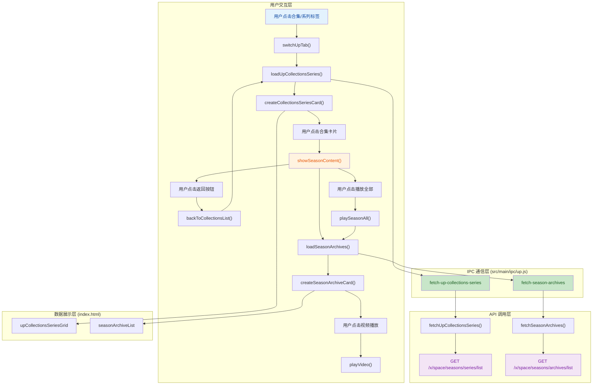

## 1. 高层摘要 (TL;DR)

* **影响范围:** 🟡 **中等** - 新增了完整的合集和系列功能模块，同时调整了全局视频网格布局
* **核心变更:**
  * ✨ 实现了 UP 主合集和系列列表的展示与详情查看功能
  * ✨ 新增了合集内容浏览、返回列表、播放全部等交互功能
  * 🎨 优化了视频网格布局，从自适应改为固定 5 列
  * 🐛 修复了事件监听器，改用事件委托方式处理标签点击
  * 🔧 移除了侧边栏用户头像点击事件

---

## 2. 可视化概览 (代码与逻辑图)



---

## 3. 详细变更分析

### 📦 后端 IPC 处理 (src/main/ipc/up.js)

**新增功能:**

| IPC 处理器                      | 功能描述                    | API 端点                           |
| ------------------------------- | --------------------------- | ---------------------------------- |
| `fetch-up-collections-series` | 获取 UP 主的合集和系列列表  | `/x/space/seasons/series/list`   |
| `fetch-season-archives`       | 获取指定合集/系列的详细内容 | `/x/space/seasons/archives/list` |

**关键实现:**

- 两个 API 都使用了 **WBI 签名机制** 进行请求签名
- `fetchUpCollectionsSeries()` 合并了 `seasons_list` 和 `series_list` 返回
- `fetchSeasonArchives()` 支持分页查询，按时间正序排列

---

### 🎨 前端页面逻辑 (src/renderer/pages/up.js)

#### 新增核心函数:

| 函数名                            | 功能                                          |
| --------------------------------- | --------------------------------------------- |
| `loadUpCollectionsSeries()`     | 加载合集和系列列表，支持分页                  |
| `createCollectionsSeriesCard()` | 创建合集/系列卡片，包含封面、标题、数量、时间 |
| `showSeasonContent()`           | 显示合集详情页，包含返回按钮、播放全部按钮    |
| `backToCollectionsList()`       | 返回合集列表视图                              |
| `loadSeasonArchives()`          | 加载合集内的视频列表                          |
| `createSeasonArchiveCard()`     | 创建合集内视频卡片                            |
| `playSeasonAll()`               | 播放合集第一个视频                            |
| `formatDuration()`              | 格式化视频时长 (秒 → MM:SS)                  |
| `formatNumber()`                | 格式化数字 (10000+ → x.x万)                  |

#### 页面状态管理新增字段:

```javascript
pageStates.up.collectionsPage = 1           // 当前合集页码
pageStates.up.hasMoreCollections = true     // 是否有更多合集
pageStates.up.collectionsLoading = false    // 合集加载状态
pageStates.up.currentSeasonPage = 1         // 当前合集详情页码
pageStates.up.currentSeasonId = null        // 当前合集 ID
pageStates.up.currentSeasonMid = null       // 当前合集所属 UP 主 ID
```

#### UI 重置逻辑更新:

- `resetUpProfileUI()` 新增对合集相关元素的清理
- 包括网格容器、加载提示、占位符等

---

### 🖼️ HTML 结构变更 (index.html)

**合集和系列标签页结构重构:**

```html
<!-- 之前: 占位符 -->
<div class="up-placeholder">合集和系列功能开发中...</div>

<!-- 之后: 完整功能结构 -->
<div class="collections-series-grid" id="upCollectionsSeriesGrid"></div>
<div class="loading-more" id="upCollectionsSeriesLoadingMore">加载中...</div>
<div class="no-more" id="upCollectionsSeriesNoMore">— 到底了 —</div>
<div class="up-placeholder" id="upCollectionsSeriesPlaceholder">暂无合集和系列</div>
```

---

### 🎯 事件监听优化 (src/renderer/core/event-listeners.js)

**变更说明:**

- **之前:** 直接遍历 `.up-tab` 元素绑定点击事件
- **之后:** 使用 **事件委托**，在 `document` 上监听点击，通过 `closest('.up-tab')` 判断目标

**优势:**

- 动态添加的标签页也能响应点击事件
- 减少事件监听器数量，提升性能

---

### 📐 样式调整

#### 全局网格布局统一调整:

| 文件                                    | 原布局                                    | 新布局             |
| --------------------------------------- | ----------------------------------------- | ------------------ |
| `src/style/style.css`                 | `repeat(auto-fill, minmax(260px, 1fr))` | `repeat(5, 1fr)` |
| `src/style/components/video-card.css` | `repeat(auto-fill, minmax(260px, 1fr))` | `repeat(5, 1fr)` |
| `src/style/pages/dynamic.css`         | `repeat(auto-fill, minmax(260px, 1fr))` | `repeat(5, 1fr)` |
| 间距                                    | `24px`                                  | `20px`           |

#### 新增合集相关样式 (src/style/pages/up-profile.css):

| 样式类                        | 功能                     |
| ----------------------------- | ------------------------ |
| `.collections-series-grid`  | 合集列表网格 (4 列)      |
| `.collections-series-card`  | 合集卡片样式，带悬停效果 |
| `.collections-series-stack` | 卡片堆叠视觉效果         |
| `.season-detail-header`     | 合集详情头部             |
| `.season-back-btn`          | 返回按钮                 |
| `.play-all-btn`             | 播放全部按钮 (粉色主题)  |
| `.video-grid`               | 合集内视频网格 (4 列)    |

---

### 🗑️ 代码清理 (src/renderer/renderer.js)

**移除内容:**

- 侧边栏用户头像点击事件监听器 (原功能: 点击头像跳转到个人主页)

**可能原因:**

- 避免与其他导航逻辑冲突
- 或该功能已通过其他方式实现

---

## 4. 影响与风险评估

### ⚠️ 潜在风险

| 风险项                   | 描述                                                | 建议                         |
| ------------------------ | --------------------------------------------------- | ---------------------------- |
| **固定列数布局**   | 改为固定 5 列可能在窄屏上显示不佳                   | 测试不同屏幕尺寸下的显示效果 |
| **WBI 签名依赖**   | API 调用依赖 WBI 密钥，密钥获取失败会导致功能不可用 | 添加错误提示和降级处理       |
| **状态管理复杂度** | 新增多个状态字段，需确保状态同步                    | 检查页面切换时的状态重置逻辑 |
| **事件委托变更**   | 事件监听方式变更可能影响其他功能                    | 全面测试标签切换功能         |

### ✅ 测试建议

1. **合集列表功能:**

   - 测试有合集的 UP 主页面
   - 测试无合集的 UP 主页面 (应显示占位符)
   - 测试分页加载和"到底了"提示
2. **合集详情功能:**

   - 点击合集卡片进入详情页
   - 测试返回按钮功能
   - 测试"播放全部"按钮
3. **布局兼容性:**

   - 测试不同分辨率下的 5 列网格显示
   - 测试合集详情页的 4 列网格显示
4. **边界情况:**

   - 网络请求失败时的错误处理
   - 空数据状态展示
   - 快速切换标签页时的加载状态

---

## 5. 总结

本次变更主要实现了 **UP 主合集和系列功能**，从后端 API 调用、前端页面逻辑到 UI 样式都进行了完整的开发。同时统一了全局视频网格布局为固定 5 列，优化了事件监听机制。整体功能设计合理，但需要注意固定布局在不同屏幕尺寸下的适配问题。
