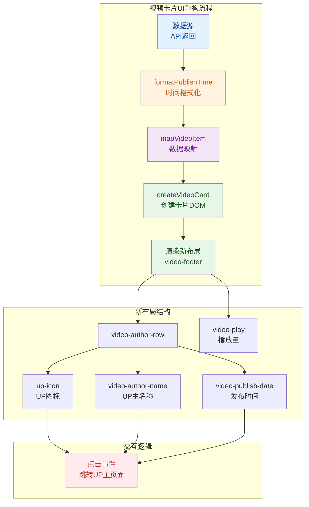

## 1. 高层摘要（TL;DR）

* **影响范围**：中 - 主要是UI层面的重构和文档整理，涉及多个页面的视频卡片组件
* **核心变更**：
  * 🎨 重构视频卡片布局，UP主信息移至左侧并添加图标
  * 📅 新增智能发布时间显示（今天/昨天/X天前等）
  * 📝 整理TODO文档，添加统计概览和Bug列表
  * ✨ 优化交互体验，UP主图标/名称/时间均可点击跳转

## 2. 可视化概览（代码与逻辑图）



## 3. 详细变更分析

### 🎨 组件：视频卡片UI重构

**变更说明**：全面重构视频卡片的底部信息布局，提升视觉层次和用户体验。

**涉及文件**：

- `src/renderer/components/video-card.js`
- `src/renderer/pages/dynamic.js`
- `src/renderer/pages/home.js`
- `src/renderer/pages/my.js`
- `src/renderer/renderer.js`
- `src/style/components/video-card.css`

**布局变更对比**：

| 元素                 | 旧布局         | 新布局                                  |
| :------------------- | :------------- | :-------------------------------------- |
| **容器类名**   | `video-meta` | `video-footer` + `video-author-row` |
| **UP主位置**   | 右侧单独显示   | 左侧，带图标                            |
| **时间显示**   | 无             | UP主名称后显示                          |
| **可点击区域** | 仅UP主名称     | UP主图标 + 名称 + 时间                  |

**新增功能**：

1. **UP主图标**：添加SVG格式的"UP"图标

```javascript
<svg class="up-icon up-clickable" viewBox="0 0 40 28" fill="none">
  <rect x="2" y="2" width="36" height="24" rx="6" ry="6" stroke="currentColor" stroke-width="1.5" fill="none"/>
  <text x="20" y="20" text-anchor="middle" font-size="13" font-weight="bold" fill="currentColor" font-family="inherit">U P</text>
</svg>
```

2. **智能时间格式化**：新增 `formatPublishTime()` 函数

   - 今天：显示"今天"
   - 昨天：显示"昨天"
   - 7天内：显示"X天前"
   - 30天内：显示"X周前"
   - 365天内：显示"X个月前"
   - 超过1年：显示"YYYY-MM-DD"
3. **交互优化**：所有UP主相关元素（图标、名称、时间）都添加了点击事件

```javascript
const upClickableElements = card.querySelectorAll('.up-clickable')
upClickableElements.forEach(el => {
  el.addEventListener('click', e => {
    e.stopPropagation()
    const mid = el.dataset.mid || video.owner?.mid || video.mid
    if (mid && onAuthorClick) onAuthorClick(mid)
  })
})
```

**样式变更**（`src/style/components/video-card.css`）：

| 样式类                  | 用途       | 关键属性                                          |
| :---------------------- | :--------- | :------------------------------------------------ |
| `.video-footer`       | 底部容器   | `display: flex; justify-content: space-between` |
| `.video-author-row`   | UP主信息行 | `display: flex; align-items: center; gap: 3px`  |
| `.up-icon`            | UP主图标   | `width: 22px; height: 16px`                     |
| `.video-author-name`  | UP主名称   | `max-width: 100px; overflow: hidden`            |
| `.video-publish-date` | 发布时间   | 自动添加"·"分隔符                                |
| `.up-clickable:hover` | 悬停效果   | `color: #fb7299` (粉色)                         |

### 📅 工具函数：时间格式化

**变更说明**：在多个文件中添加了 `formatPublishTime()` 函数，用于智能格式化视频发布时间。

**实现位置**：

- `src/renderer/renderer.js` (第697-720行)
- `src/renderer/pages/home.js` (第3-26行)
- `src/renderer/pages/my.js` (第470-493行)

**函数逻辑**：

```javascript
function formatPublishTime(timestamp) {
  if (!timestamp) return ''
  const date = new Date(timestamp * 1000)
  const now = new Date()
  const diff = now - date
  const oneDay = 24 * 60 * 60 * 1000
  
  if (diff < oneDay && date.getDate() === now.getDate()) {
    return '今天'
  } else if (diff < 2 * oneDay) {
    return '昨天'
  } else if (diff < 7 * oneDay) {
    return `${Math.floor(diff / oneDay)}天前`
  } else if (diff < 30 * oneDay) {
    return `${Math.floor(diff / (7 * oneDay))}周前`
  } else if (diff < 365 * oneDay) {
    return `${Math.floor(diff / (30 * oneDay))}个月前`
  } else {
    const year = date.getFullYear()
    const month = String(date.getMonth() + 1).padStart(2, '0')
    const day = String(date.getDate()).padStart(2, '0')
    return `${year}-${month}-${day}`
  }
}
```

**数据映射变更**：在视频数据对象中添加 `publish_date` 字段

```javascript
// 在 mapVideoItem 和各个数据加载函数中
{
  // ... 其他字段
  publish_date: formatPublishTime(item.pubdate || item.pubtime || item.ctime || item.sendtime || 0)
}
```

### 📝 文档：TODO重构

**变更说明**：将TODO文档重新组织，提升可读性和可维护性。

**文件变更**：

- `TODO.md` - 重构后的新版本
- `docs/TODO-old.md` - 旧版本备份

**新结构**：

| 章节          | 内容                     | 状态 |
| :------------ | :----------------------- | :--- |
| 📊 统计概览   | 总任务数、已完成、未完成 | 新增 |
| ✅ 已完成任务 | 按模块分类的已完成任务   | 重组 |
| 🔄 待完成任务 | 按模块分类的待完成任务   | 重组 |
| 🐛 Bug列表    | 表格化展示Bug和修复状态  | 新增 |
| 📋 待实现功能 | 未来规划的功能           | 重组 |

**统计信息**：

- 总任务数：107
- 已完成：77 (72%)
- 未完成：30 (28%)

**Bug列表表格**：

```markdown
| 序号 | Bug描述 | 状态 | 修复 |
| :--: | ------- | :--: | ---- |
| 1 | 弹幕乱码 | 待修复 | ✅ |
| 2 | 播放器右键菜单功能失效 | 待修复 | ✅ |
| ... | ... | ... | ... |
```

### ⚙️ 配置：快捷键配置

**变更说明**：在快捷键配置文件中添加了一个空行（可能是格式化调整）。

**文件**：`src/config/defaultShortcuts.conf`

```diff
  [shortcuts]
+ 
  focusSearch.label=聚焦搜索框
```

## 4. 影响与风险评估

### ✅ 积极影响

1. **用户体验提升**：

   - 视频卡片信息层次更清晰
   - 发布时间一目了然
   - 更大的可点击区域，操作更便捷
2. **视觉一致性**：

   - 所有页面的视频卡片统一使用新布局
   - 悬停效果统一为粉色
3. **文档可维护性**：

   - TODO文档结构化，便于跟踪进度
   - Bug列表表格化，便于管理

### ⚠️ 潜在风险

1. **代码重复**：

   - `formatPublishTime()` 函数在3个文件中重复定义
   - **建议**：提取到公共工具模块
2. **样式兼容性**：

   - 旧样式类 `.video-meta` 被移除
   - **风险**：如果有其他地方引用旧类名会失效
   - **建议**：检查全局搜索确保无遗漏引用
3. **时间戳格式**：

   - 函数假设输入为Unix时间戳（秒）
   - **风险**：如果API返回毫秒时间戳会导致错误
   - **建议**：添加时间戳单位检测或统一转换

### 🧪 测试建议

1. **功能测试**：

   - ✅ 测试不同页面的视频卡片显示是否一致
   - ✅ 测试点击UP主图标/名称/时间是否都能正确跳转
   - ✅ 测试不同时间段的视频发布时间显示是否正确
2. **边界测试**：

   - ✅ 测试今天、昨天、一周前、一个月前、一年前的视频
   - ✅ 测试没有时间戳的视频（应不显示时间）
   - ✅ 测试UP主名称过长时的显示（应截断显示省略号）
3. **回归测试**：

   - ✅ 测试历史记录页面的视频卡片
   - ✅ 测试收藏夹页面的视频卡片
   - ✅ 测试动态页面的视频卡片
4. **视觉测试**：

   - ✅ 测试深色主题下的显示效果
   - ✅ 测试悬停效果是否正常
   - ✅ 测试不同屏幕尺寸下的布局

### 📌 注意事项

- 所有变更都是UI层面的，不影响核心业务逻辑
- 没有API接口变更
- 没有数据库结构变更
- 向后兼容，但旧样式类 `.video-meta` 已废弃
