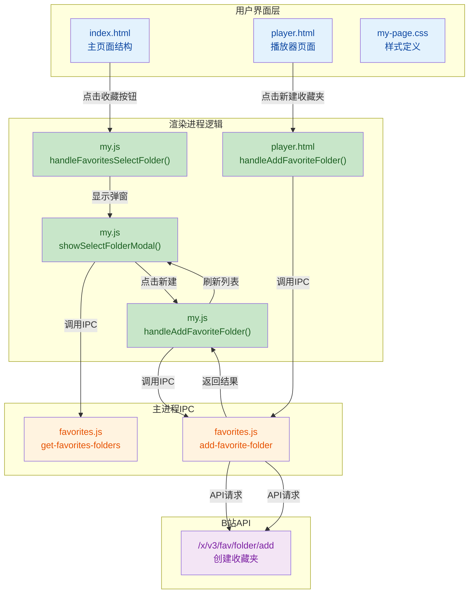

## 1. 高层摘要（TL;DR）

* **影响：** 🟡 **中等** - 新增收藏夹创建和选择功能，涉及多个模块的UI和逻辑变更
* **核心变更：**
  * ✨ 新增"新建收藏夹"功能，支持创建公开/私密收藏夹
  * ✨ 新增"选择收藏夹"弹窗，优化收藏视频的交互流程
  * 🎨 完善暗色主题支持，新增弹窗的深色模式样式
  * 📝 更新TODO描述，更准确地标记已知问题

---

## 2. 可视化概览（代码与逻辑映射）

---

## 3. 详细变更分析

### 🎨 UI/HTML 结构变更

#### **index.html**

- **新增收藏夹子标签页右侧按钮区域**

  - 添加了 `favorites-sub-tabs-right` 容器
  - 新增"新建收藏夹"按钮（带加号图标）
- **新增两个弹窗结构**

  - **选择收藏夹弹窗** (`select-folder-modal`)：包含标题、收藏夹列表容器、新建按钮和取消按钮
  - **新建收藏夹弹窗** (`add-favorite-modal`)：包含名称输入框（最大20字符）、公开/私密复选框、确定和取消按钮

#### **src/pages/player.html**

- **新增新建收藏夹按钮**：在收藏弹窗底部添加"新建收藏夹"按钮
- **新增新建收藏夹弹窗**：与 index.html 类似的弹窗结构，用于播放器页面快速创建收藏夹

### 🧠 逻辑层变更

#### **src/main/ipc/favorites.js**

- **新增 IPC 处理器**：`add-favorite-folder`
  - **参数验证**：检查标题非空且不超过20字符
  - **CSRF Token 获取**：从 cookie 中获取 `bili_jct`
  - **API 调用**：调用 B站 API `https://api.bilibili.com/x/v3/fav/folder/add`
  - **参数映射**：
    - `privacy: 0` = 公开，`privacy: 1` = 私密
    - 同时传递 `public` 和 `privacy` 参数

#### **src/renderer/pages/my.js**

- **新增选择收藏夹功能**

  - `showSelectFolderModal(video)` - 显示选择弹窗并加载收藏夹列表
  - `loadFoldersForSelect()` - 通过 IPC 获取收藏夹列表
  - `renderFolderList(folders)` - 渲染收藏夹列表（单选交互）
  - `handleSelectFolder(fid, folderName)` - 执行收藏操作并显示提示
  - `openAddFolderFromSelect()` - 从选择弹窗跳转到新建弹窗
- **新增新建收藏夹功能**

  - `showAddFavoriteModal()` - 显示新建弹窗并重置表单
  - `hideAddFavoriteModal()` - 隐藏新建弹窗
  - `handleAddFavoriteFolder()` - 验证表单并调用 IPC 创建收藏夹，成功后刷新列表
- **修改现有功能**

  - `handleFavoritesSelectFolder()` - 从显示 Toast 改为显示选择收藏夹弹窗
- **事件绑定**

  - `bindSelectFolderEvents()` - 绑定选择弹窗的关闭、取消、新建按钮事件
  - `bindAddFavoriteFolderEvents()` - 绑定新建弹窗的所有按钮事件
  - `bindModalEvents()` - 统一初始化所有弹窗事件

#### **src/pages/player.html (JavaScript)**

- **新增新建收藏夹相关函数**
  - `openAddFavoriteFolderModal()` - 关闭收藏弹窗，打开新建弹窗
  - `showAddFavoriteModal()` - 显示新建弹窗
  - `hideAddFavoriteModal()` - 隐藏新建弹窗
  - `handleAddFavoriteFolder()` - 创建收藏夹并显示结果提示
  - 新增点击遮罩层关闭弹窗的事件监听

### 🎨 样式变更

#### **src/style/pages/my-page.css**

- **新增样式类**（约430行）：
  - `.add-favorite-folder-btn` - 新建收藏夹按钮（渐变粉色背景）
  - `.select-folder-modal` - 选择收藏夹弹窗容器
  - `.select-folder-item` - 收藏夹列表项（支持悬停和选中状态）
  - `.select-folder-radio` - 单选按钮样式
  - `.add-favorite-modal` - 新建收藏夹弹窗容器
  - `.add-favorite-input` - 输入框样式
  - `.add-favorite-checkbox-custom` - 自定义复选框样式

#### **src/style/dark-theme.css**

- **新增暗色主题样式**（约140行）：
  - 为所有新增弹窗组件添加暗色主题适配
  - 使用 `#2a2a2a` 作为背景色，`#3a3a3a` 作为边框色
  - 保持粉色渐变主题色 `#fb7299` 在暗色模式下的可见性
  - 调整文字颜色为 `#e0e0e0` 和 `#808080`

#### **src/pages/player.html (CSS)**

- **新增播放器页面专用样式**：
  - `.favorites-modal-btn.add-folder` - 收藏弹窗中的新建按钮
  - `.add-favorite-modal-overlay` - 弹窗遮罩层
  - 完整的新建收藏夹弹窗样式（与 my-page.css 类似但独立）

### 📝 文档变更

#### **TODO.md**

- **修改 TODO 描述**：
  - 原：`- [ ] 搜索页面卡片时长`
  - 新：`- [ ] 搜索页面卡片时长没有正确展示`
  - 更准确地描述了已知问题

---

## 4. 影响与风险评估

### ⚠️ 破坏性变更

无破坏性变更，所有新增功能均为向后兼容。

### 🔍 测试建议

| 测试场景             | 验证要点                                                     |
| -------------------- | ------------------------------------------------------------ |
| **新建收藏夹** | 输入空名称、超过20字符、正常创建、公开/私密切换              |
| **选择收藏夹** | 列表加载、单选交互、点击收藏后提示、ESC键关闭                |
| **弹窗交互**   | 点击遮罩层关闭、从选择弹窗跳转到新建弹窗、创建成功后刷新列表 |
| **暗色主题**   | 切换暗色主题后弹窗样式正常、文字可读性良好                   |
| **播放器页面** | 在播放器页面创建收藏夹功能正常                               |
| **错误处理**   | 网络错误、API返回错误、缺少CSRF Token时的提示                |

### 🎯 关键风险点

1. **CSRF Token 依赖**：创建收藏夹依赖 `bili_jct` cookie，如果用户未登录或 cookie 过期会失败
2. **表单验证**：前端和后端都有长度验证（20字符），需确保一致性
3. **弹窗层级**：新增弹窗的 z-index 为 1000/1001，需确保不被其他元素遮挡
4. **状态管理**：`currentVideoToFavorite` 变量在弹窗关闭时清空，需确保在异常情况下也能正确清理

---

## 5. 技术亮点

✨ **用户体验优化**：从简单的 Toast 提示升级为完整的选择收藏夹弹窗，用户可以精确选择收藏夹
✨ **流程连贯性**：在选择收藏夹弹窗中可直接新建收藏夹，无需关闭弹窗再操作
✨ **主题一致性**：所有新增组件都支持暗色主题，保持界面风格统一
✨ **代码复用**：播放器页面和我的页面共用相似的弹窗逻辑，但各自维护独立的样式
✨ **输入验证**：前后端双重验证，确保数据安全性和用户体验
