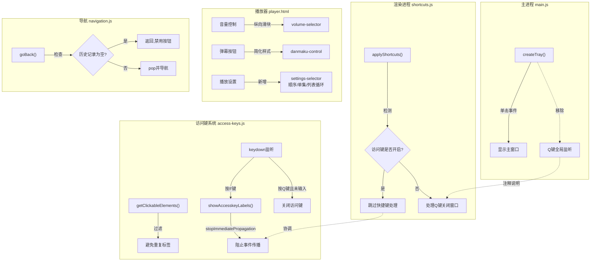

## 1. 高级摘要 (TL;DR)

* **影响范围**: 🟡 **中等** - 涉及播放器UI重构、快捷键系统优化和导航逻辑改进
* **核心变更**:
  * 🎮 **播放器UI重构**: 音量控制改为纵向滑块，弹幕按钮简化，新增播放模式选择器
  * ⌨️ **快捷键冲突修复**: 将Q键关闭窗口功能从主进程移至渲染进程，解决与访问键的冲突
  * 🔙 **导航优化**: 返回按钮添加禁用状态，防止过度返回
  * 🖱️ **托盘交互改进**: 系统托盘从双击改为单击打开主窗口

---

## 2. 可视化概览 (代码与逻辑映射)



---

## 3. 详细变更分析

### 🎮 3.1 播放器UI重构 (src/pages/player.html)

**变更说明**: 全面重构播放器控制栏UI，提升用户体验

| 组件               | 旧设计             | 新设计                | 改进点                         |
| ------------------ | ------------------ | --------------------- | ------------------------------ |
| **音量控制** | 横向进度条         | 纵向滑块 + 悬浮选择器 | 更符合桌面应用习惯，支持拖拽   |
| **弹幕按钮** | 图标+文字+状态标签 | 简化为单字符"弹"      | 视觉更简洁，状态通过颜色区分   |
| **播放设置** | 无                 | 新增设置选择器        | 支持顺序播放/单集循环/列表循环 |
| **音量面板** | 左上角固定显示     | 优化样式和图标        | 更清晰的视觉反馈               |

**关键代码变更**:

```javascript
// 音量控制改为纵向滑块
const setVolumeFromEvent = (e) => {
  const rect = volumeSlider.getBoundingClientRect()
  const percent = 1 - (e.clientY - rect.top) / rect.height  // 纵向计算
  const volume = Math.max(0, Math.min(1, percent))
  videoPlayer.volume = volume
  updateVolumeDisplay()
  saveVolume(volume)
}

// 新增播放模式选择器
<div class="playback-settings">
  <button class="setting-option active" data-mode="sequential">顺序播放</button>
  <button class="setting-option" data-mode="single">单集循环</button>
  <button class="setting-option" data-mode="list">列表循环</button>
</div>
```

---

### ⌨️ 3.2 快捷键冲突修复 (main.js + shortcuts.js + access-keys.js)

**变更说明**: 解决Q键关闭窗口与访问键功能的冲突问题

| 文件                     | 变更内容                            | 原因                       |
| ------------------------ | ----------------------------------- | -------------------------- |
| **main.js**        | 移除主进程Q键全局监听               | 避免与访问键冲突           |
| **shortcuts.js**   | 添加访问键状态检测                  | 访问键开启时跳过快捷键处理 |
| **access-keys.js** | 添加 `stopImmediatePropagation()` | 阻止事件传播到其他监听器   |

**核心逻辑变更**:

```javascript
// main.js - 移除全局Q键监听
-// 监听全局快捷键 Q 键
-app.on('web-contents-created', (event, contents) => {
-  contents.on('before-input-event', (event, input) => {
-    if (input.type === 'keyDown' && input.key.toLowerCase() === 'q') {
-      // 关闭窗口逻辑...
-    }
-  })
-})
+// Q 键关闭窗口的快捷键已由渲染进程的 shortcuts.js 统一处理，
+// 避免主进程全局监听与访问键 (access-keys) 等功能冲突

// shortcuts.js - 添加访问键冲突检测
function applyShortcuts(e) {
  if (!shortcutsEnabled) return
  
+  // 如果访问键标签正在显示，不处理任何快捷键
+  if (typeof accesskeyEnabled !== 'undefined' && accesskeyEnabled) return
  // ... 其他快捷键处理
}

// access-keys.js - 阻止事件传播
document.addEventListener('keydown', e => {
  if (e.key === 'f' && !e.ctrlKey && !e.shiftKey && !e.altKey && !e.metaKey) {
    e.preventDefault()
+   e.stopImmediatePropagation()  // 阻止传播到shortcuts.js
    showAccesskeyLabels()
    return
  }
})
```

---

### 🔙 3.3 导航系统优化 (navigation.js + renderer.js)

**变更说明**: 改进返回按钮逻辑，添加禁用状态

| 组件               | 旧行为          | 新行为                 |
| ------------------ | --------------- | ---------------------- |
| **返回按钮** | 无历史时隐藏    | 无历史时显示但禁用     |
| **goBack()** | 无保护直接pop   | 检查历史为空时直接返回 |
| **按钮状态** | 通过display控制 | 通过disabled类控制     |

**代码变更**:

```javascript
// navigation.js
function goBack() {
+  // 已回到首页，不允许继续返回
+  if (pageHistory.length === 0) return
+
  const prevPage = pageHistory.pop()
  navigateToPage(prevPage)
}

function updateBackButton() {
  const backBtn = document.getElementById('sidebarBackBtn')
  if (backBtn) {
-   backBtn.style.display = pageHistory.length > 0 ? 'flex' : 'none'
+   if (pageHistory.length > 0) {
+     backBtn.classList.remove('disabled')
+     backBtn.title = '返回上一页'
+   } else {
+     backBtn.classList.add('disabled')
+     backBtn.title = '已回到首页'
+   }
  }
}
```

**样式变更** (layout.css + dark-theme.css):

```css
/* layout.css */
.sidebar-back-btn {
+ display: flex;  /* 始终显示 */
  /* ... */
}

.sidebar-back-btn.disabled {
  color: #c9ccd0;
  cursor: default;
  opacity: 0.4;
}

/* dark-theme.css */
body.dark-theme .sidebar-back-btn.disabled {
  color: #555;
  opacity: 0.3;
}
```

---

### 🖱️ 3.4 系统托盘交互改进 (main.js)

**变更说明**: 托盘图标从双击改为单击打开主窗口

```javascript
// main.js
-// 双击托盘显示窗口
-sharedState.tray.on('double-click', () => {
+// 点击托盘显示窗口
+sharedState.tray.on('click', () => {
    if (sharedState.mainWindow) {
      sharedState.mainWindow.show()
    }
  })
```

---

### 🏷️ 3.5 访问键功能优化 (access-keys.js + renderer.js)

**变更说明**: 优化访问键标签显示逻辑，避免重复标签

| 优化项                       | 旧逻辑             | 新逻辑                             |
| ---------------------------- | ------------------ | ---------------------------------- |
| **video-card内部元素** | 显示多个标签       | 只在card本身显示标签               |
| **up-clickable处理**   | 显示所有up相关元素 | 只显示up名称，跳过图标和时间       |
| **Q键处理**            | 按Q直接关闭        | 未输入时关闭，已输入时作为普通字母 |

**代码变更**:

```javascript
// 跳过 video-card 内部的子元素
if (!el.classList.contains('video-card') && el.closest('.video-card')) {
  return
}

// 对于 up-clickable，只保留 up 名称
if (el.classList.contains('up-clickable')) {
  const wrapper = el.closest('.video-item-wrapper')
  if (wrapper && wrapper.querySelector('.video-card')) {
    if (!el.classList.contains('video-author-name')) {
      return
    }
  }
}

// Q键智能处理
- if (e.key === 'Escape') {
+ if (e.key === 'Escape' || (e.key === 'q' && accesskeyInput === '')) {
    hideAccesskeyLabels()
    return
  }
```

---

### 📋 3.6 任务清单更新 (TODO.md)

**变更说明**: 标记大量已完成功能，更新任务进度

| 功能模块           | 新增已完成项                  |
| ------------------ | ----------------------------- |
| **我的页面** | 删除接口400修复、我的收藏功能 |
| **UP主页面** | 合集详情优化                  |
| **关注页面** | 取消关注、设置分组功能        |
| **播放器**   | 异步下载、Vim风格f键绑定      |
| **系统功能** | 系统托盘、文章动态、收藏功能  |
| **视频卡片** | UP主名称调整、日期显示优化    |

---

## 4. 影响与风险评估

### ⚠️ 4.1 破坏性变更

| 变更项                     | 影响范围     | 用户影响                       |
| -------------------------- | ------------ | ------------------------------ |
| **托盘双击→单击**   | 系统托盘交互 | 用户习惯需要适应，但更符合直觉 |
| **Q键行为改变**      | 快捷键系统   | 解决了冲突，提升可用性         |
| **返回按钮始终显示** | 导航UI       | 视觉变化，但功能更明确         |

### ✅ 4.2 测试建议

**高优先级测试场景**:

1. **快捷键冲突测试**:

   - 按F键开启访问键，再按Q键验证不会关闭窗口
   - 在访问键模式下输入"AQ"等含Q的标签，验证Q键作为普通字母处理
   - 关闭访问键后，按Q键验证能正常关闭窗口
2. **播放器UI测试**:

   - 测试音量纵向滑块的拖拽和点击
   - 验证弹幕按钮的状态切换（开/关颜色变化）
   - 测试播放模式切换（顺序/单集循环/列表循环）
3. **导航测试**:

   - 在首页验证返回按钮为禁用状态
   - 导航到多级页面后，验证返回按钮正常工作
   - 验证返回到首页后按钮自动禁用
4. **访问键测试**:

   - 验证video-card只显示一个标签
   - 验证UP主名称只显示名称，不显示图标和时间
   - 测试新增的可点击元素（collections-series-card、my-anime-card等）

**中优先级测试场景**:

- 系统托盘单击打开主窗口
- 暗色主题下返回按钮的禁用状态样式
- 音量面板的显示和隐藏逻辑

---

## 5. 总结

本次更新主要聚焦于**用户体验优化**和**系统稳定性改进**：

✨ **亮点改进**:

- 播放器UI更加现代化，符合桌面应用交互习惯
- 彻底解决了快捷键冲突问题，提升键盘操作体验
- 导航系统更加健壮，避免异常状态

🔧 **技术债务清理**:

- 移除了主进程的全局键盘监听，职责更清晰
- 统一了快捷键处理逻辑，避免多处重复代码
- 优化了访问键的元素选择算法，减少重复标签

📊 **完成度提升**:

- TODO清单显示大量功能已完成，项目进展顺利
- 核心功能（收藏、关注、播放器）已基本完善
